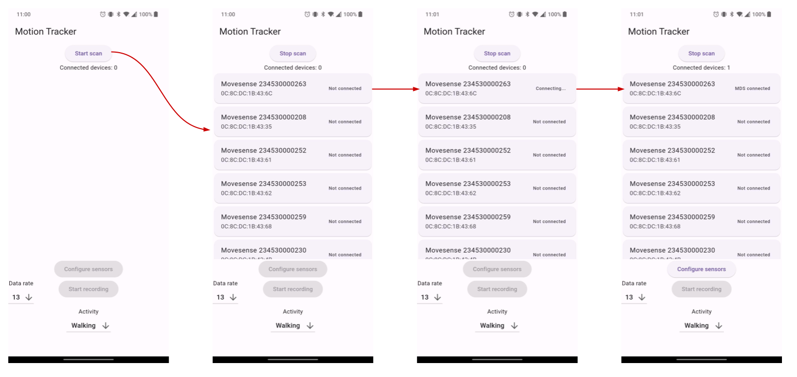
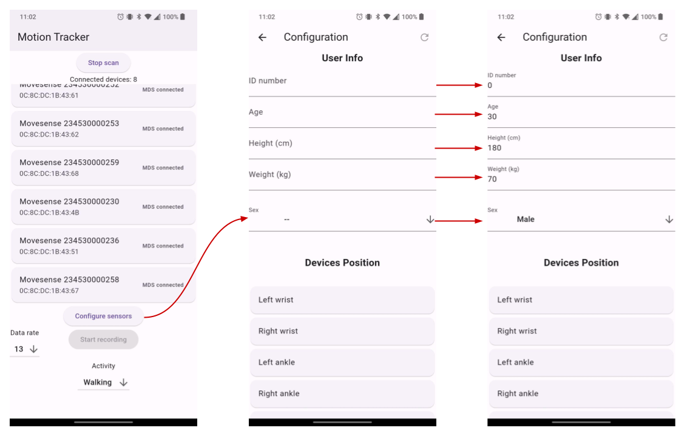
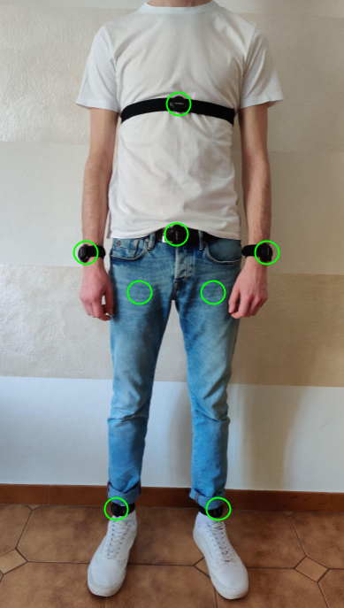
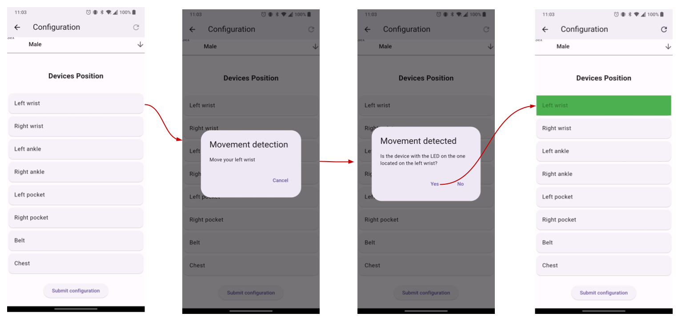
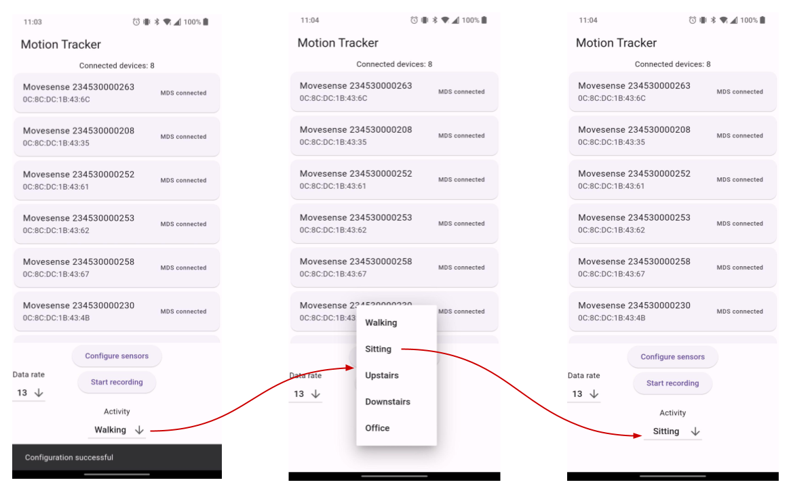
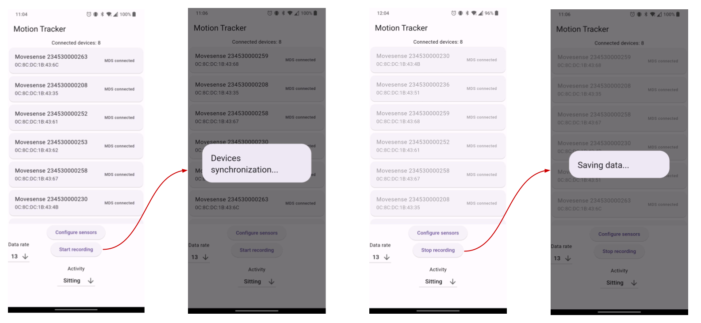

# Motion Tracker

Motion Tracker is a mobile application designed for the simultaneous collection of inertial data from multiple [Movesense HR+](https://www.movesense.com/product/movesense-sensor-hr/) wearable sensors.

## Technology Stack

Motion Tracker was developed using [Flutter](https://flutter.dev/), a cross-platform framework for building natively compiled applications for mobile, web, and desktop from a single codebase. By leveraging Flutter, Motion Tracker offers seamless compatibility with both Android and iOS devices.

[mdsflutter](https://pub.dev/packages/mdsflutter), a Movesense developed Flutter plugin, has been leveraged for the application development.

## Features

- **Multi-Sensor Data Collection**: Collect inertial data from up to eight Movesense HR+ sensors simultaneously, via Bluetooth Low Energy (BLE) connection.
- **User Configuration**: Insert user information directly within the application.
- **Sensor Configuration**: Automated association of sensors with their respective positions on the user's body.
- **Data Rate Control**: Adjust the data collection rate. The maximum achievable data rate using eight sensors is 13Hz (tested on Onplus 7t).
- **Activity Selection**: Choose from a predefined list of activities for data collection.

## Project Context

Motion Tracker was developed as part of [TEMPO](https://prin-tempo.github.io/), an EU-funded project aimed at monitoring the activities of hemophiliac patients. The application's primary goal was to build a comprehensive dataset of inertial data associated with various activities. This dataset, collected from multiple wearable sensors positioned at different locations on the body, will be used to evaluate the optimal sensor position(s) for activity recognition.

## Functionalities and Design

### Sensor Connectivity

The application utilizes the mdsflutter plugin, to scan for available Movesense sensors and establish a BLE connection. For the sensors to start advertising and become discoverable, they need to be activated by touching the metal studs on their back.

### Configuration

Once a BLE connection with the sensors is established, users are prompted to attach the sensors to their bodies and proceed to the configuration phase. During this stage they are required to enter personal information including:

- An identification number
- Their age
- Their height
- Their weight
- Their sex

Following this input, the configuration of the devices can be started. Users are
presented with a list of buttons, each corresponding to a potential sensor placement
on the body. The available placement options are:

    

        <ul>
            <li>Left wrist</li>
            <li>Right wrist</li>
            <li>Left ankle</li>
            <li>Right ankle</li>
            <li>Left pocket</li>
            <li>Right pocket</li>
            <li>Belt</li>
            <li>Chest</li>
        </ul>
    

    

        
    

To configure sensor positions, the process includes the following steps:

1. **Body movement for Sensor Identification**: Upon selecting a button, e.g. ”Left wrist”, the user is prompted to move the
   corresponding part of their body (at this point they would be wearing the
   sensors).
   Simultaneously, the app begins to collect accelerometer data from all connected
   sensors to detect motion.
2. **Detecting Sensor Movement**: The application analyzed the incoming accelerometer data to determine which
   sensor is moving. It does so by calculating the running standard deviation of
   the accelerometer data for each sensor.
3. **Sensor Identification and Confirmation**: If the running standard deviation from a sensor’s data exceeds a predefined
   threshold, indicating significant movement, the app activated a LED light on
   that sensor as a visual clue.
   The user is then asked to confirm if the lit sensor corresponds to the body
   position they selected. If the user confirms (”yes”), the sensor is successfully
   associated with that body position.
   If the user denies (”no”), the app cycles through the other sensors, prioritizing
   them based on the magnitude of their accelerometer data’s standard deviation,
   until the correct sensor is identified and confirmed by the user.
4. **Completing the Configuration**: This process is repeated for each body position until all connected sensors are
   correctly associated.

### Activity Selection

The application allows users to choose a specific activity from a drop-down menu, before initiating data recording. The selectable activities include:

- **Walking**
- **Sitting**
- **Upstairs**: engaging in walking upstairs
- **Downstairs**: engaging in walking downstairs
- **Office**: performing computer office work
  Once the data recording begins, the application associates the chosen activity with the collected inertial data, ensuring that each dataset is labeled according to the user’s activity at the time of recording.

### Data Gathering

Initiating recording by pressing the ’Start recording’ button triggers the synchronization process with the connected sensors, beginning with setting the current Coordinated Universal Time (UTC) on each device via PUT requests. To ensure accuracy, this synchronization is performed three times per sensor.
Afterwards, the application retrieves the current UTC and relative time (the time elapsed from the last UTC reset) and begins recording and retrieving data utilising a subscription method from the mdsflutter plugin.
To cease recording, the user presses the ’Stop recoding’ button, which sends an unsubscribe request to the sensors.

### Data Saving

In the data collection phase, the smartphone application retrieves inertial data from the sensors using Movesense’s subscription feature. This data is continuously transmitted from the sensor to the mobile device, where it is temporarily stored in a dictionary-like structure, specifically as a Dart List of Lists.
When the recording is stopped, the application enriches the data structure with additional information including the initial and final UTCs and relative times, the user information and the sensor’s placement on the body. Subsequently, the structure
is converted into CSV format and saved as a CSV file on the smartphone’s internal storage (under the "/Movesense" directory on Android and on the application support directory on IoS).
